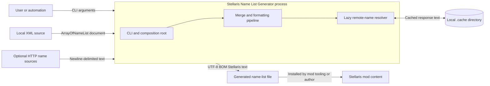
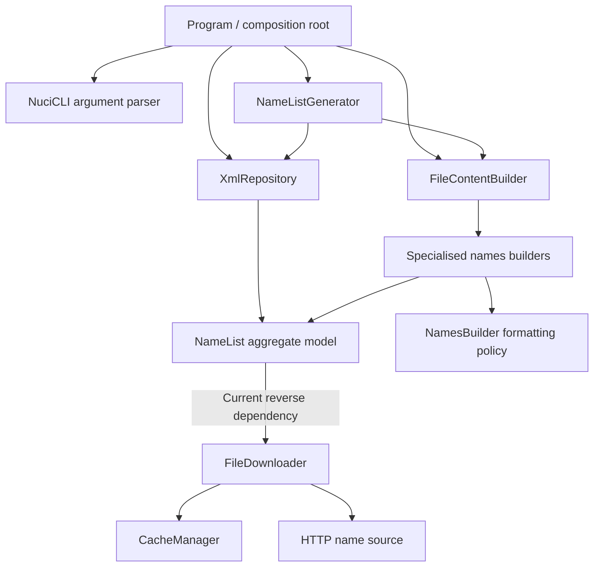
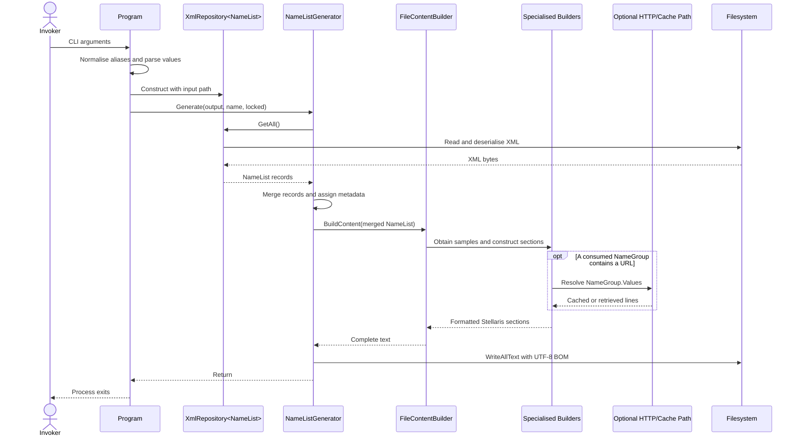
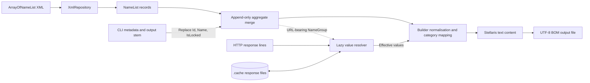
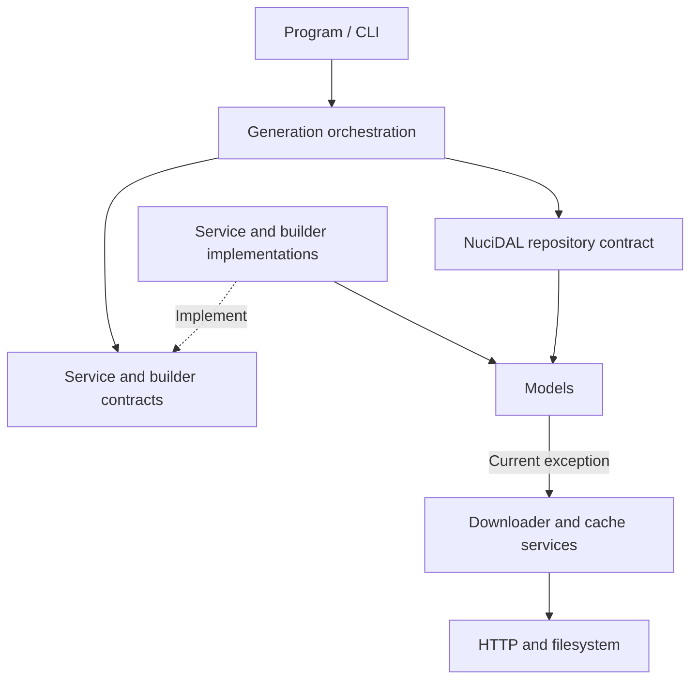

# Stellaris Name List Generator Architecture

This document describes the verified current architecture of the Stellaris Name List Generator executable and its adjacent repository tooling. It covers command processing, XML ingestion, optional remote name resolution, transformation, Stellaris text generation, local persistence, and operational constraints; it does not propose a target architecture.

## 📑 Table of Contents

- [Table of Contents](#table-of-contents)
- [Purpose](#purpose)
- [System Context](#system-context)
- [Architectural Style](#architectural-style)
- [Runtime Flow](#runtime-flow)
- [Components](#components)
- [Data Architecture](#data-architecture)
- [Interfaces and Integrations](#interfaces-and-integrations)
- [Name Transformation and Stellaris Formatting](#name-transformation-and-stellaris-formatting)
- [Cross-Cutting Concerns](#cross-cutting-concerns)
- [Security and Privacy](#security-and-privacy)
- [Error Handling](#error-handling)
- [Observability](#observability)
- [Configuration](#configuration)
- [Concurrency and Resource Use](#concurrency-and-resource-use)
- [Dependency Direction and Rules](#dependency-direction-and-rules)
- [External Dependencies](#external-dependencies)
- [Deployment and Operations](#deployment-and-operations)
- [Compatibility Contracts](#compatibility-contracts)
- [Testing and Verification](#testing-and-verification)
- [Design Constraints](#design-constraints)
- [Extension Points](#extension-points)
- [Output Builders](#output-builders)
- [Input Repository](#input-repository)
- [Related Documentation](#related-documentation)

## 🎯 Purpose

The system converts one or more structured XML name lists into one Stellaris-compatible text file. This document records the executable boundary, responsibility allocation, dependency direction, data lifecycle, and compatibility-sensitive formats so contributors can locate the owner of a change and evaluate its effects. The principal audience is maintainers modifying the command interface, XML model, category builders, remote source integration, or generated format.

## 🌐 System Context

A user or automation process invokes a local .NET console executable with input, output, display-name, and lock arguments. The executable reads XML from the local filesystem through a repository adapter, may retrieve newline-delimited names from URLs embedded in the XML, and writes a generated name-list file for inclusion in Stellaris mod content. Optional remote responses are cached beneath the process working directory. The process has no database, listener, authentication boundary, or direct game integration.



The principal external boundaries are:
- **CLI Invoker:** Supplies untrusted argument values and filesystem paths; [Program.cs](Program.cs) owns normalisation, parsing, and composition.
- **Local Filesystem:** Owns the source XML, generated file, and conditional `.cache` state. The process operates with the invoking user's permissions.
- **Remote Name Sources:** Supply optional newline-delimited text over HTTP according to each [`NameGroup.Url`](Models/NameGroup.cs); the remote service remains external to the repository.
- **Stellaris Mod Content:** Consumes the generated text after an external author or packaging process places it in a mod. The generator does not launch or communicate with Stellaris.

## 🏗️ Architectural Style

The implementation is a synchronous console transformation pipeline with manual constructor composition. [Program.cs](Program.cs) acts as the composition root, [NameListGenerator](Service/NameListGenerator.cs) orchestrates repository access and persistence, [FileContentBuilder](Service/FileContentBuilder.cs) assembles the outer document, and specialised builders under [Service/NamesBuilders](Service/NamesBuilders/) map the aggregate model to Stellaris categories. Interfaces separate orchestration from most implementations, although [`NameGroup`](Models/NameGroup.cs) directly constructs the remote download and cache services and therefore crosses the intended model-to-service boundary.



The principal architecture boundaries are:
- **Composition Boundary:** [`Program.Main`](Program.cs) selects concrete implementations and assigns process-lifetime collaborators without a dependency injection container.
- **Orchestration Boundary:** [`NameListGenerator`](Service/NameListGenerator.cs) owns aggregate retrieval, multi-record merging, runtime metadata assignment, content generation, and the final write.
- **Transformation Boundary:** [`FileContentBuilder`](Service/FileContentBuilder.cs) and the specialised builders own Stellaris syntax, category mapping, normalisation, and fallback policy.
- **Data Boundary:** Types under [Models](Models/) represent XML data and the merged in-memory aggregate. `NameGroup` additionally owns lazy remote-value resolution in the current implementation.
- **Adapter Boundary:** NuciDAL provides XML repository access, while [`FileDownloader`](Service/FileDownloader.cs) and [`CacheManager`](Service/CacheManager.cs) adapt HTTP and local cache storage.

## 🔄 Runtime Flow



The principal runtime sequence is:
1. `Program` maps legacy short options to canonical long options, parses three required values and the optional `locked` value, and converts the latter to a Boolean.
2. The composition root constructs six specialised builders, the content builder, an `XmlRepository<NameList>`, and the generator.
3. `NameListGenerator` obtains every XML record. A single record is retained directly; multiple records are appended into a separate aggregate through [`NameList.AddRange`](Models/NameList.cs).
4. The generator replaces aggregate metadata with the output filename stem, CLI display name, and CLI lock value.
5. `FileContentBuilder` requests random header samples and formatted sections in ship, ship-class, fleet, army, planet, and character order.
6. Access to `NameGroup.Values` lazily combines explicit values with optional remote lines. The remote path consults the filesystem cache prior to issuing an HTTP request.
7. The complete content is written synchronously with a UTF-8 byte-order mark, after which the process terminates.

## 🧩 Components

| Component | Responsibility | Principal Dependencies | Lifetime or Ownership |
|-----------|----------------|------------------------|-----------------------|
| [`Program`](Program.cs) | Normalises and parses CLI options and constructs the object graph. | NuciCLI, NuciDAL, service interfaces and implementations | Static process entry point; composition occurs once per invocation. |
| [`NameListGenerator`](Service/NameListGenerator.cs) | Retrieves and merges records, assigns runtime metadata, invokes formatting, and persists the result. | `IFileContentBuilder`, `IFileRepository<NameList>`, filesystem | One instance constructed by `Program` per invocation. |
| `XmlRepository<NameList>` | Deserialises the XML source into aggregate records. | NuciDAL and the caller-supplied input path | One repository instance per invocation, owned by `Program`. |
| [`FileContentBuilder`](Service/FileContentBuilder.cs) | Constructs headers, the outer name-list block, the `randomized` option, and ordered builder sections. | Six builder interfaces and `NameList` | One instance per invocation, owned by `Program`. |
| [Specialised Names Builders](Service/NamesBuilders/) | Map domain collections to ship, class, fleet, army, planet, and character categories. | `NameList`, model subtypes, shared `NamesBuilder` policy | Six stateless collaborators constructed per invocation. |
| [`NamesBuilder`](Service/NamesBuilders/NamesBuilder.cs) | Supplies shared array, fallback, duplicate-removal, line-wrapping, comparison, and character-normalisation policy. | NuciExtensions and model values | Base implementation inherited by specialised builders. |
| [`NameList`](Models/NameList.cs) and Model Types | Represent deserialised source data and the merged mutable aggregate. | NuciDAL `EntityBase`; collections of model types | Created by deserialisation or merge and retained for one generation. |
| [`NameGroup`](Models/NameGroup.cs) | Combines explicit values with lazily resolved URL values and memoises the resolved URL per instance. | `FileDownloader` and `CacheManager` concrete implementations | Aggregate-owned instances plus a type-owned static downloader. |
| [`FileDownloader`](Service/FileDownloader.cs) | Applies cache-first retrieval and performs optional HTTP GET requests. | `ICacheManager`, process-wide static `HttpClient` | One static instance owned indirectly by the `NameGroup` type. |
| [`CacheManager`](Service/CacheManager.cs) | Creates `.cache`, derives cache filenames, and reads or writes response text with an eight-hour validity test. | Local filesystem and process working directory | Constructed with the static downloader; cache files persist across invocations. |

## 💾 Data Architecture

The executable owns no database. NuciDAL deserialises an `ArrayOfNameList` XML document, exemplified by [exampleNameList.xml](exampleNameList.xml), into one or more mutable `NameList` aggregates. Multi-record merging appends corresponding collections in source order; conflict resolution does not occur at this stage. Specialised builders subsequently normalise, filter, combine, and remove duplicates from the values they consume.

CLI metadata supersedes source metadata: the output path stem becomes `NameList.Id`, `--name` becomes `NameList.Name`, and `--locked` becomes `NameList.IsLocked`. Each `NameGroup` exposes an effective value list composed from XML `ExplicitValues` plus remotely resolved lines. Remote text is cached in `.cache` for eight hours according to file creation time; expired files remain present but are ignored. The final file is recreated with UTF-8 BOM encoding on each successful invocation. There is no schema version, migration mechanism, transactional store, or retained in-memory state after process termination.



| Data or Store | Owner | Representation and Storage | Lifecycle or Consistency |
|---------------|-------|----------------------------|--------------------------|
| `ArrayOfNameList` Source | NuciDAL repository adapter | XML at the caller-supplied input path | Read once per invocation; no explicit XML schema validation is present in the repository. |
| `NameList` Aggregate | `NameListGenerator` during generation | Mutable object graph in process memory | Single-record reuse or append-only multi-record merge; discarded at process termination. |
| Effective `NameGroup.Values` | `NameGroup` | Recent list combining explicit XML values and optional response lines | Recomputed on access; remote lines are memoised while the configured URL remains unchanged. |
| Remote Response Cache | `CacheManager` | Text files beneath `.cache`, named from filtered URL characters | Entries younger than eight hours are read; no eviction or collision resolution is implemented. |
| Generated Name List | `NameListGenerator` | Stellaris syntax in a caller-selected UTF-8 BOM file | Rewritten per successful invocation; no atomic replacement or version retention is implemented. |

## 🔌 Interfaces and Integrations

| Interface or Integration | Direction | Contract | Owner | Failure Semantics |
|--------------------------|-----------|----------|-------|-------------------|
| CLI | Inbound | `--input`, `--output`, and `--name` are required; `--locked` defaults to `false`. `-i`, `-o`, `-n`, and `-l` are compatibility aliases, and bare `-l` means `true`. | `Program` and NuciCLI | Missing or invalid values produce exceptions and terminate the invocation. |
| XML Name-List Document | Inbound | NuciDAL XML serialisation of one or more `NameList` records beneath `ArrayOfNameList`. | `XmlRepository<NameList>` and model types | Deserialisation, model-shape, and filesystem failures are not translated by the executable and terminate generation. |
| Remote Name Source | Outbound | HTTP GET to `NameGroup.Url`; response content is divided on newline characters and appended to explicit values. | `NameGroup` and `FileDownloader` | Retrieval exceptions are caught by `NameGroup`, reported to standard output, and degraded to no remote values. HTTP status is not explicitly validated prior to caching content. |
| Filesystem Cache | Bidirectional | Cache-first text retrieval beneath hard-coded `.cache`; validity is eight hours from creation time. | `CacheManager` | Cache exceptions reached during lazy resolution are generally absorbed by `NameGroup`; type initialisation and unrelated filesystem failures have no dedicated translation. |
| Stellaris Name-List File | Outbound | Hand-constructed Stellaris assignments, arrays, sequential-name fallbacks, and metadata encoded as UTF-8 with BOM. | `FileContentBuilder`, builders, and `NameListGenerator` | Formatting and write failures propagate and terminate the invocation; a partial filesystem result is not explicitly recovered. |

## ⚙️ Name Transformation and Stellaris Formatting

[`NamesBuilder`](Service/NamesBuilders/NamesBuilder.cs) centralises the compatibility-sensitive value policy. It removes duplicates, compares selected values without diacritics where required, transliterates or replaces numerous characters, wraps generated array lines at a maximum of 150 characters, and emits either `random_names` values or a `sequential_name` fallback. Specialised builders then map model collections to Stellaris keys and derive categories from generic and specific sources.

The output body is assembled in a fixed builder order: ship names, ship classes, fleets, armies, planets, and characters. Fleet and army builders can synthesise sequential patterns, while character groups are emitted by identifier and descending weight. [`FileContentBuilder`](Service/FileContentBuilder.cs) also places randomly selected leader, ship, fleet, and colony examples in comment headers. Consequently, comment samples can differ between invocations even when the functional category content is identical.

The lock flag is represented through an inverted Stellaris option: `IsLocked == true` emits `randomized = no`, while `false` emits `randomized = yes`. The formatter uses four-space indentation and platform-native line separators. Stellaris key names, fallback tokens such as `%O%`, `%C%`, and `%R%`, transliteration rules, and section syntax are compatibility contracts rather than presentation-only details.

## 🧵 Cross-Cutting Concerns

### Security and Privacy

The executable has no authentication, authorisation, secret store, or telemetry. CLI paths, XML content, and embedded URLs cross into the process without an application-level validation layer. A URL-bearing input can initiate an outbound request, and remote content is accepted as name data without size, scheme, host, or status validation. Remote failure reporting includes the supplied URL, so URLs must not contain credentials or sensitive query values. Cache filenames retain only a restricted character set; distinct URLs can therefore map to an identical local filename.

Filesystem reads and writes execute with the invoker's permissions, and the caller controls both principal paths. The adjacent [release script](release.sh) downloads and executes an external script through the shell, creating a separate release-time supply-chain trust boundary that is not part of normal generation.

### Error Handling

Argument parsing, XML access, merge and builder failures, and final output writes have no local exception translation or retry policy; an exception terminates the invocation. Missing alias values explicitly produce `ArgumentNullException`, and invalid Boolean values produce `ArgumentException`. The optional remote branch is the sole degradation path: `NameGroup` catches retrieval exceptions, emits a console message, and continues with explicit values only. The broad catch does not distinguish network, cache, parsing, or cancellation failures.

### Observability

There are no structured logs, metrics, traces, health checks, or audit records. The only explicit runtime diagnostic is a console message when a remote name list cannot be retrieved. Successful generation is represented by the output file and process completion; failures otherwise rely upon unhandled exception diagnostics from the .NET host.

### Configuration

| Configuration Area | Source | Responsibility | Override or Secret Policy |
|--------------------|--------|----------------|---------------------------|
| Invocation Metadata | CLI arguments | Selects input path, output path, display name, and lock state. | Required CLI values replace XML metadata; no environment or file-based override exists. |
| Name Data and Remote Sources | XML document | Supplies all domain collections and optional `NameGroup.Url` values. | No secondary configuration source or secret injection mechanism exists. |
| Cache Policy | Compiled constants and process working directory | Selects `.cache` and an eight-hour validity interval. | Neither location nor duration is configurable. |

### Concurrency and Resource Use

The principal flow is single-threaded and synchronous. The remote adapter uses asynchronous `HttpClient` APIs internally, but `NameGroup` blocks on the resulting task through `.Result`; no cancellation token or application-level request bound is exposed. A static `HttpClient` is reused for the process lifetime.

All records, merged collections, remote response strings, and generated content are materialised in memory. The implementation applies no explicit input-size or collection bounds. Separate processes can execute concurrently, but `.cache` and caller-selected output paths have no inter-process locking, so corresponding filenames can contend or overwrite one another.

## 🧭 Dependency Direction and Rules

The principal dependency direction is from the entry point into service contracts and implementations, then into the model. `NameListGenerator` depends upon `IFileContentBuilder` and NuciDAL's `IFileRepository<NameList>`; `FileContentBuilder` depends upon specialised builder interfaces; specialised builders depend upon model types and shared formatting policy. This permits orchestration collaborators to be substituted at constructor boundaries.

The current exception is `Models.NameGroup`, which imports the service namespace and constructs `FileDownloader(new CacheManager())` in a static field. The downloader and cache interfaces therefore do not presently isolate the model or provide an application composition point.



The principal dependency rules are:
- `Program` owns concrete selection and object-graph construction; service implementations do not depend upon the entry point.
- `NameListGenerator` owns final persistence, while builders return strings and do not write the generated file.
- `FileContentBuilder` owns section order and outer syntax; specialised builders own category-specific mapping.
- Model collection names and shapes remain coupled to NuciDAL XML serialisation.
- Optional remote resolution currently violates the otherwise inward dependency direction and must be considered when modifying `NameGroup`, downloader lifetime, or cache policy.
- Auxiliary shell scripts operate as separate processes and are not runtime dependencies of the .NET executable.

## 📦 External Dependencies

| Dependency | Responsibility | Integration Boundary | Architectural Consequence |
|------------|----------------|----------------------|---------------------------|
| [.NET 10](StellarisNameListGenerator.csproj) | Hosts the console process and supplies filesystem, HTTP, text, and collection primitives. | Executable target framework and base class library | Deployment requires a compatible runtime or an appropriate published artefact. |
| `NuciCLI` and `NuciCLI.Arguments` | Supply command argument parsing. | `Program` | Parser conduct and accepted canonical syntax depend upon package contracts; local alias normalisation precedes parsing. |
| `NuciDAL` | Supplies `EntityBase`, `IFileRepository<T>`, and `XmlRepository<T>`. | Models and `Program` composition | XML persistence and model identity are coupled to the package's serialisation and repository contracts. |
| `NuciExtensions` | Supplies collection and text utility extensions used during name selection and normalisation. | Specialised builders and `NamesBuilder` | Random selection and utility semantics are package-coupled transformation details. |
| Remote HTTP Providers | Optionally supply newline-delimited name data. | `NameGroup` through `FileDownloader` | Generation can depend upon network availability unless a valid cache entry or explicit values suffice. |
| Shell Utilities | Support extraction, XML merging, and release automation through [extractor.sh](extractor.sh), [merge.sh](merge.sh), and [release.sh](release.sh). | Operator-invoked scripts | These tools are auxiliary and require a compatible shell environment; they do not execute during normal .NET generation. |

## 🚀 Deployment and Operations

The deployment unit is a .NET 10 console executable constructed from one project. Each invocation creates one process, reads one XML path, and attempts to produce one output file; there is no resident service, port, scheduler, or distributed topology. Normal operation requires read access to the input, write access to the output parent directory, and write access to the current working directory when `NameGroup` initialisation creates `.cache`. Network access is conditional upon URL-backed groups being consumed.

Repository CI in [.github/workflows/dotnet.yml](.github/workflows/dotnet.yml) restores, builds, and invokes `dotnet test` on Ubuntu for pushes and pull requests to `master`. Release automation is delegated by [release.sh](release.sh) to an externally retrieved deployment script. The helper [extractor.sh](extractor.sh) and [merge.sh](merge.sh) scripts prepare XML-related artefacts independently of the executable.

| Concern | Current Design | Architectural Consequence |
|---------|----------------|---------------------------|
| Process Topology | One local process per command invocation. | Horizontal concurrency consists of independent processes, with no coordinator or shared in-memory state. |
| Persistent State | Caller-selected output plus optional `.cache` files. | Operators own path permissions, retention, cleanup, and collision prevention. |
| Availability and Recovery | No daemon, checkpoint, transaction, or resume mechanism. | A failed invocation must be corrected and repeated; an output path may require inspection after write failure. |
| Network | Used only for consumed URL-backed name groups. | Offline execution is dependable only when remote values are unnecessary or valid cache content exists. |
| Resource Capacity | Input and output are materialised in memory without configured bounds. | Capacity is constrained by process memory, remote response size, and filesystem capacity. |
| Release | A shell script delegates to remotely hosted release logic. | Release availability and integrity depend upon that external endpoint and shell toolchain. |

## 🛡️ Compatibility Contracts

| Contract | Owner | Invariant | Verification | Change Policy |
|----------|-------|-----------|--------------|---------------|
| CLI Options and Aliases | `Program` | Required long options, optional Boolean lock semantics, legacy aliases, and bare `-l` support remain accepted. | Invoke canonical and alias smoke commands. | Treat removal or semantic modification as a breaking command-interface change. |
| XML Model Shape | Model types and NuciDAL adapter | `ArrayOfNameList`, public property names, nested collections, `NameGroup.Values`, and optional `Url` remain deserialisable. | Generate from [exampleNameList.xml](exampleNameList.xml) and representative multi-record/URL fixtures. | Coordinate model modifications with source migration or compatibility aliases. |
| Output Identity and Lock Mapping | `NameListGenerator` and `FileContentBuilder` | Output filename stem supplies the top-level identifier; CLI name supplies the comment name; locked maps to `randomized = no`. | Inspect generated metadata for locked and unlocked invocations. | Preserve semantics unless consumers and documentation migrate together. |
| Stellaris Text Grammar | `FileContentBuilder` and specialised builders | Category keys, braces, arrays, `sequential_name`, `random_names`, fallback tokens, four-space indentation, and section structure remain accepted by Stellaris. | Golden-file comparison and in-game/mod validation; no such automated suite currently exists. | Treat grammar or key modifications as compatibility-sensitive changes. |
| Character Normalisation | `NamesBuilder` | Duplicate comparison, transliteration, replacement, and sanitisation rules produce supported output characters. | Focused fixtures spanning supported scripts and diacritics; current coverage is absent. | Additive mappings require regression verification; semantic replacements can modify generated identifiers. |
| Output Encoding | `NameListGenerator` | The generated file uses UTF-8 with a byte-order mark. | Inspect generated bytes or compare a binary fixture. | Preserve unless Stellaris compatibility is explicitly revalidated. |

## ✅ Testing and Verification

The repository contains no test project or automated test source files. The CI workflow nevertheless executes `dotnet test`, which currently provides compilation/project validation rather than demonstrated behavioural coverage. Architecture-sensitive modifications require at minimum a successful restore and build plus generation from the example XML. CLI aliases, multi-record merging, URL/cache degradation, empty collections, normalisation, category mappings, encoding, and Stellaris acceptance remain material coverage gaps.

Execute the principal automated verification with:

```bash
dotnet restore
dotnet build --no-restore
dotnet test --no-build --verbosity normal
```

Execute a generation smoke test with:

```bash
dotnet run --no-build -- \
  --input exampleNameList.xml \
  --output generated_name_list.txt \
  --name "Architecture Verification" \
  --locked true
```

The smoke result must be inspected for a top-level identifier derived from `generated_name_list.txt`, `randomized = no`, expected builder sections, and UTF-8 BOM encoding. Stellaris ingestion remains a specialised manual verification until a representative parser or golden-output suite is introduced.

## ⚠️ Design Constraints

- **Complete Input Expectations:** Builders frequently select random values or access nested collections; missing or vacant groups can terminate generation rather than producing a partial document.
- **Append-Only Merge:** Multiple source records are concatenated without entity-level conflict resolution. Duplicate and category filtering occurs later and varies by builder policy.
- **Hand-Constructed Grammar:** Stellaris text is assembled with `StringBuilder` and formatter methods rather than a syntax tree or external schema, concentrating grammar compatibility in builder code.
- **Non-Deterministic Headers:** Random comment samples prevent byte-identical results for identical inputs even when the functional name pools have not changed.
- **Synchronous Remote Resolution:** Lazy URL retrieval blocks the generation thread and provides no caller cancellation, explicit retry, or status validation.
- **Cache Identity and Retention:** URL character filtering can produce filename collisions; the eight-hour test uses creation time, and expired files are not eliminated automatically.
- **Layering Exception:** `NameGroup` directly owns concrete service construction, so downloader and cache substitutions cannot be configured from `Program` despite their interfaces.
- **Platform-Sensitive Text:** `Environment.NewLine` produces platform-native line separators, while encoding remains explicitly UTF-8 with BOM.
- **Model-to-Output Coverage:** Some represented or merged fields, including airports, water bodies, geographical places, and robot manufacturers, have no current builder emission path and therefore do not affect generated content.
- **Single-File Generation:** One invocation writes one complete file; incremental generation, streaming, batch output coordination, and atomic replacement are not implemented.

## 🔧 Extension Points

### Output Builders

1. Implement or revise the relevant contract under [Service/NamesBuilders](Service/NamesBuilders/).
2. Integrate the implementation into [`FileContentBuilder`](Service/FileContentBuilder.cs) and construct it in [`Program`](Program.cs).
3. Add verification for category keys, fallback policy, normalisation, ordering, and representative populated and vacant inputs.

An extension must preserve the Stellaris grammar, indentation, line-length policy, key naming, duplicate handling, and the outer builder ordering contract where order is material. Adding a seventh category currently modifies both constructor composition points rather than using dynamic registration.

### Input Repository

1. Implement or provide an `IFileRepository<NameList>` compatible source adapter.
2. Integrate the implementation at the [`Program`](Program.cs) composition boundary or construct `NameListGenerator` from another host.
3. Verify `GetAll()` ordering, aggregate completeness, merge semantics, and failure propagation.

The adapter must return fully initialised model collections expected by `NameList.AddRange` and the builders. The shipped executable always selects NuciDAL's XML repository; repository substitution is currently a code-level composition extension, not a CLI configuration function.

## 📚 Related Documentation

- [README.md](README.md) defines installation prerequisites, CLI usage, the input template, helper scripts, and operator troubleshooting. This document concentrates upon internal boundaries and change-sensitive contracts instead.
